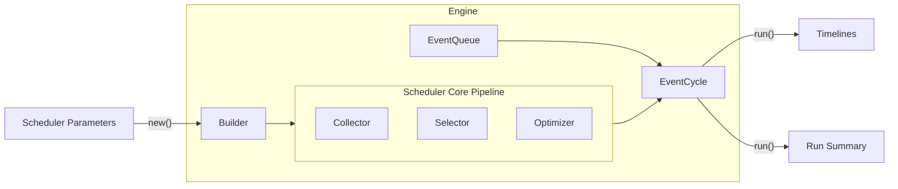

# High-Level Architecture

Below shows a High-Level architecture for the Scheduler process.
This exact proces is done in both the GraphQL server

## Scheduler Parameters

::: scheduler.engine.SchedulerParameters

## Engine
::: scheduler.engine.Engine

